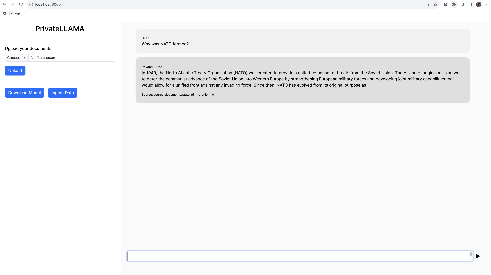

# PrivateLLAMA (LLAMA 2)

Create a QnA chatbot on your documents without relying on the internet by utilizing the capabilities of local LLMs. Ensure complete privacy and security as none of your data ever leaves your local execution environment. Seamlessly process and inquire about your documents even without an internet connection. Inspired from [SamurAIGPT](https://github.com/SamurAIGPT)



## Contents

* [Getting started](#getting-started)
* [Requirements](#requirements)
* [How to run](#how-to-run)
* [Support](#support)
* [Data](#data)
* [Check repos](#check-repos)

## Getting started

Code is up, ⭐ (Star) the repo meanwhile to receive updates

Follow [Akhil](https://twitter.com/akhilkarun) on twitter for updates

## Requirements

* Python 3.8 or later
* NodeJS v18.12.1 or later (nvm install 18.12.1 to upgrade)
* Minimum 16GB of memory

## How to run

1. Go to client folder and run the below commands

   ```shell
   npm install   
   ```

   ```shell
   npm run dev
   ```

2. Go to server folder and run the below commands (feel free to use virtual env)

   ```shell
   pip install -r requirements.txt # for some it might be pip3 instead of pip
   ```

   ```shell
   python privateLLAMA.py # for some it might be python3 instead of python
   ```

3. Open <http://localhost:3000>, click on download model to download the required model initially

4. Upload any document of your choice and click on Ingest data. Ingestion is fast

5. Now run any query on your data. Data querying is slow and thus wait for sometime

6. IMPORTANT: If there are errors in model processing download the model manually from [here](https://huggingface.co/TheBloke/Llama-2-7B-GGML/blob/main/llama-2-7b.ggmlv3.q2_K.bin) and replace the file in folder /models 


## Support

Reach out [Akhil](https://twitter.com/akhilkarun) on twitter to get support

## Data

The supported extensions for documents are:

* .csv: CSV,
* .docx: Word Document,
* .enex: EverNote,
* .eml: Email,
* .epub: EPub,
* .html: HTML File,
* .md: Markdown,
* .msg: Outlook Message,
* .odt: Open Document Text,
* .pdf: Portable Document Format (PDF),
* .pptx : PowerPoint Document,
* .txt: Text file (UTF-8),


